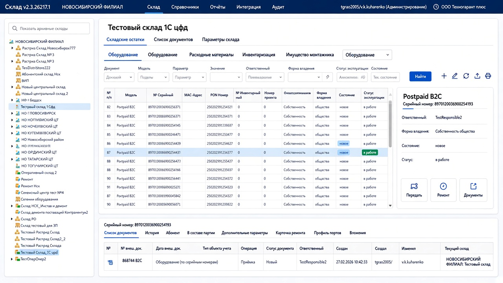

# Эталон UI склада для ChatGPT

Загрузи этот файл в чат **вместе с** `docs/mockups/warehouse-ui-mockup.png` и исходниками одной View. Дальше правь проект по макету, а не «на вкус».

Ты senior WPF-разработчик. Задача: постепенно внедрить новый UI в существующий офлайн WPF-проект. Сначала переделать **одну View склада** как эталон. Не меняй бизнес-логику, binding-пути, имена свойств, команды, модели и состав данных. Не удаляй вкладки, колонки, фильтры, поля и пункты меню. Меняй компоновку, стили, шаблоны и визуальную иерархию.

## Целевой результат

Modernized master-detail для склада.

Старый каркас продукта сохранить:

- слева дерево складов
- сверху меню и вкладки раздела
- снизу детали выбранного объекта

Внутри контента новая сетка:

- центр — таблица оборудования
- справа — карточка выбранного объекта
- снизу — вкладки документов / истории / ремонта

Эталон: 

---

## Что нельзя потерять

### Шапка приложения

- название `Склад`, версия, филиал
- пункты меню: `Склад`, `Справочники`, `Отчёты`, `Интеграция`, `Аудит`
- пользователь / роль / организация справа

Если шапка живёт в `Shell` / `MainWindow`, не выкидывай её из продукта. Только обнови стиль.

### Левая панель

- поиск складов / `Показать архивные склады`
- полное дерево складов
- выделение текущего склада

### Верх контента

- заголовок текущего склада
- главные вкладки: `Складские остатки` | `Список документов` | `Параметры склада`
- второй ряд вкладок учёта: `Оборудование` | `Расходные материалы` | `Инвентаризация` | `Имущество монтажника`
- существующий combobox типа объекта, если он уже есть

### Фильтры

Все текущие поля оставить, даже если они станут компактнее:

`Документ`, `Модель`, `Параметр`, `Значение`, `Ответственный`, `Форма владения`, `Статус эксплуатации`, `Состояние`, `Тех. состояние`, кнопка `Найти`.

Тулбар действий сохранить, но собрать в группу outline-иконок: добавить / обновить / экспорт / печать и остальные текущие команды.

### Таблица оборудования

Все текущие колонки оставить. Минимум должны читаться:

`№ п/п`, `Модель`, `№ Серийный`, `MAC-Адрес`, `PON Номер`, `№ Инвентарный`, `Номер проекта`, `Номер из вн. системы`, `Ответственный`, `Форма владения`, `Состояние`, `Статус эксплуатации`.

Если колонок больше — не удалять, допустим горизонтальный скролл.

### Нижняя панель выбранного объекта

Все текущие вкладки оставить:

`Список документов` | `История` | `Абонент` | `В составе партии` | `Дополнительные параметры` | `Карточка ремонта` | `Профиль портов` | `Вложения`

Сохранить все их внутренние поля и таблицы. Над вкладками оставить идентификатор выбранного объекта (серийный номер).

### Новый элемент

Правая карточка выбранного оборудования — **добавить**, а не заменить ею вкладки.

---

## Целевая компоновка

```text
┌──────────────────────────────────────────────────────────────────────────┐
│ SHEll 48–56px: Склад  |  Склад  Справочники  Отчёты  Интеграция  Аудит  │
├────────────┬─────────────────────────────────────────────────────────────┤
│ Дерево     │ Заголовок склада                                            │
│ 260–300px  │ Складские остатки | Список документов | Параметры склада    │
│ + splitter │ Оборудование | Расходные материалы | Инвентаризация | ...   │
│            │ Фильтры ...                                      [Найти] ⚙  │
│            │ ┌──────────────────────────────┬─────────────────────────┐  │
│            │ │ Таблица оборудования      *  │ Карточка объекта 320px  │  │
│            │ └──────────────────────────────┴─────────────────────────┘  │
│            │ splitter                                                    │
│            │ Серийный номер: …                                           │
│            │ Документы | История | Абонент | … | Вложения                │
│            │ таблица / содержимое активной вкладки                       │
└────────────┴─────────────────────────────────────────────────────────────┘
```

Grid контента внутри вкладки `Складские остатки`:

| Row | Содержимое |
| --- | --- |
| 0 | заголовок склада |
| 1 | главные вкладки контента |
| 2 | второй ряд вкладок учёта + combobox |
| 3 | фильтры + иконки действий |
| 4 `*` | таблица `*` + карточка `320–360` |
| 5 | `GridSplitter` |
| 6 `0.34*` | нижняя панель деталей |

Правая карточка:

- заголовок модели
- серийный номер
- поля: `Ответственный`, `Форма владения`, `Состояние`, `Статус`
- плитки: `Передать` / `Ремонт` / `Документы`
- синхронизация с `SelectedItem` таблицы
- если выбора нет: `Выберите оборудование`

Карточка не заменяет нижние вкладки. Она дублирует главное и даёт быстрые действия.

---

## Визуальные токены

Спокойный корпоративный SaaS. Не Material «из коробки», не старый WinForms, не Fluent ради Fluent.

| Токен | Значение |
| --- | --- |
| `AppHeaderBg` | `#0F2D5B` |
| `AppHeaderText` | `#FFFFFF` |
| `AppHeaderMenuActive` | белый текст + нижнее подчёркивание `2px` |
| `AppHeaderMenuInactive` | `rgba(255,255,255,0.78)` |
| `PageBg` | `#F4F7FB` |
| `CardBg` | `#FFFFFF` |
| `CardBorder` | `#E2E8F0` |
| `TextPrimary` | `#0F172A` |
| `TextSecondary` | `#64748B` |
| `Accent` | `#2563EB` |
| `AccentSoft` | `#E8F1FB` |
| `RowHover` | `#F8FAFC` |
| `RowSelected` | `#E8F1FB` |
| `InputBorder` | `#CBD5E1` |
| `InputBg` | `#FFFFFF` |
| `BadgeInWorkBg` / `Text` | `#DCFCE7` / `#166534` |
| `BadgeNewBg` / `Text` | `#DBEAFE` / `#1D4ED8` |
| `Splitter` | `#E2E8F0` |

Форма:

- скругление карточек `12`
- скругление полей и кнопок `8`
- скругление бейджей `999`
- тень карточек: `0 1px 3px rgba(15,23,42,0.06)`
- рамки `1px`
- без градиентов, 3D, толстых `GroupBox`, цветных WinForms-иконок и «звёздного» фона шапки

Типографика: `Segoe UI`.

| Элемент | Размер |
| --- | --- |
| Title склада | `20–22px`, semibold, `TextPrimary` |
| Меню шапки | `13–14px` |
| Вкладки контента | `13px` |
| Header таблицы | `12px`, `TextSecondary` |
| Body таблицы | `13px`, `TextPrimary` |
| Подписи фильтров | `11–12px`, `TextSecondary` |

Отступы:

- padding страницы и карточки `12–16`
- шапка `48–56`
- поле фильтра `32–36`
- строка таблицы `36–40`
- кнопка `32–36`

---

## Как должны выглядеть контролы

**Шапка.** Плоская, тёмно-синяя, без картинки-фона. Меню текстовое в одну линию. Активный пункт якорится нижней линией, а не объёмной вкладкой.

**Дерево складов.** Белая карточка на сером фоне. Поиск сверху, высота `32–36`. Выбранный узел: фон `AccentSoft`, текст `#1B4F8A`, слева полоска `Accent` `3px`. Иконки папок простые монохромные. Без сетки и без 3D plus/minus.

**Главные вкладки контента.** Текстовые, без 3D-хрома `TabControl`. Активная: `Accent` + underline `2px`. Неактивная: `TextSecondary`. Этот ряд **нельзя** прятать в заголовок или заменять KPI.

**Второй ряд вкладок учёта.** Чуть мельче главных, тот же underline. Combobox справа в этой же строке.

**Фильтры.** Одна компактная строка / wrap-панель внутри карточки. Все поля видны. Кнопка `Найти`: `Accent`, белый текст, без градиента. Иконки действий справа: квадрат `32`, ghost-стиль, фон `#F8FAFC`, рамка `CardBorder`, hover `AccentSoft`.

**Таблица.** Внутри белой карточки. Без вертикальных линий. Шапка `#F8FAFC`. Выбранная строка `AccentSoft`. `Состояние` и `Статус эксплуатации` — бейджи, не сырой текст. Это по-прежнему плотная таблица, не список карточек.

**Правая карточка.** Отдельная белая Card. Title `18px`. Серийник `TextSecondary`. Поля вертикально: caption `12px` серый, value `13–14px` тёмный. Три action-плитки в ряд: иконка сверху, подпись снизу. Hover плитки: `AccentSoft`.

**Нижняя панель.** Отдельная белая Card. Серийный номер сверху мелким текстом. Вкладки тем же underline-стилем. Таблица документов без второго хрома. Высота примерно треть рабочей области.

---

## Правила правок в проекте

Работай итеративно, не переписывай весь продукт.

1. Найди `Shell` / `MainWindow` и View склада.
2. Вынеси токены и стили в `ResourceDictionary`: `CardBorder`, `PageBackground`, `HeaderBar`, `UnderlineTab`, `FilterField`, `PrimaryButton`, `GhostIconButton`, `StatusBadge`, `TreeSelectedItem`, `DataGridModern`, `DetailCard`, `ActionTile`.
3. Обнови шапку и `TabControl` верхнего уровня, не трогая навигацию.
4. Переложи внутренности `Складские остатки` на новую `Grid`-сетку.
5. Добавь правую карточку, привязав её к `SelectedItem` уже существующей таблицы.
6. Стилизуй нижние вкладки и бейджи статусов.
7. Только потом переноси те же стили на соседние View.

Технические ограничения:

- не добавляй новые NuGet-пакеты
- используй текущие контролы: если DevExpress / Telerik / Infragistics — стилизуй их, не заменяй на стандартный `DataGrid` без необходимости
- не ломай MVVM
- не хардкодь демо-данные в XAML
- не переименовывай свойства ViewModel
- если для карточки не хватает selected-item binding, добавь минимально `SelectedEquipment` и переиспользуй текущие поля
- `GridSplitter` между деревом и контентом и между таблицей и низом обязательны
- существующие `x:Name`, если на них есть code-behind, сохрани
- русские тексты сохрани как в продукте

## Критерий готовности эталонной View

Экран должен одновременно:

- содержать все старые вкладки, фильтры, колонки и нижние разделы
- выглядеть как современный карточный SaaS
- иметь master-detail: таблица + правая карточка + низ деталей
- поддерживать смену шаблона стиля через меню-гамбургер в шапке (динамическая замена цветовых ресурсов)
- не требовать новых библиотек
- собираться в текущем офлайн-проекте

## Формат ответа

Каждый раз:

1. Коротко напиши, какой файл меняешь и зачем.
2. Выдай полный новый XAML или точный diff по файлу.
3. Выдай новые / изменённые стили.
4. Если нужна правка ViewModel — отдельно, минимально, с причиной.
5. Список: сохранено / добавлено / не трогалось.

Не давай общих лекций. Сразу правь код.

Сначала жди файлы. Пользователь пришлёт `View.xaml`, code-behind / ViewModel, стили и `.csproj` / UI-библиотеки. Начни с одной View склада и приведи её к этому макету.
